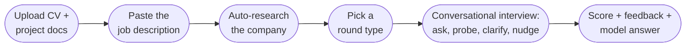
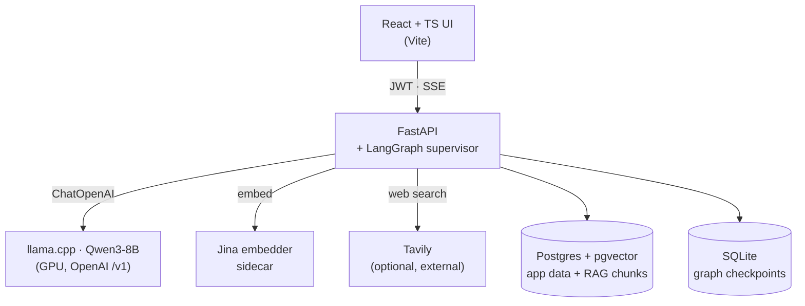

# Interview Coach

**Personalized AI interview practice.** Upload your CV and project docs, paste a
job description, pick a round, and a local LLM runs a real back-and-forth
interview — it asks tailored questions, probes your answers, then scores you and
shows a model answer.

Everything runs on your own machine: FastAPI + React, a llama.cpp GPU container,
and Postgres. No data leaves the box (except optional web search).

## Demo


## How it works



The interviewer works one **topic** at a time. Instead of firing off
disconnected questions, it stays on a thread — following up, asking you to
clarify, or nudging when you stall — then grades the whole exchange once before
moving on.

### Round types

| Round | What it tests | Grounding |
| --- | --- | --- |
| **Experience deep-dive** | Your real projects and CV | Retrieves from your docs + linked GitHub repos |
| **Technical challenge** | Forward-looking domain problems | None (tests reasoning, not recall) |
| **Behavioral / STAR** | Situation–Task–Action–Result stories | None |

## Architecture



| Piece | Role |
| --- | --- |
| **React + TypeScript** | UI; typed client streams questions/feedback over SSE |
| **FastAPI + LangGraph** | Auth, sessions, and the multi-agent interview loop |
| **llama.cpp (`llama`)** | Serves Qwen3-8B on the GPU, OpenAI-compatible `/v1` |
| **Jina embedder** | Sidecar that embeds docs for retrieval |
| **Postgres + pgvector** | App data plus grounding vectors |
| **Tavily** | Optional web search (fetch a JD from a URL, research a company) |

## Quick start

You need **Docker** with the **NVIDIA Container Toolkit** (for GPU passthrough)
and the model file (see below).

```sh
cp .env.example .env          # add TAVILY_API_KEY if you'll fetch JDs from URLs
make up                       # starts db, llama, embedder, api, ui
curl http://localhost:8000/healthz   # → {"status":"ok",...}
open http://localhost:8501           # the app
```

Cold start takes ~30–60s while `llama-server` loads the model onto the GPU; the
first agent call may be slow, then it's fast.

<details>
<summary><b>One-time: download the model (GGUF)</b></summary>

```sh
mkdir -p ~/models
huggingface-cli download unsloth/Qwen3-8B-GGUF Qwen3-8B-IQ4_XS.gguf \
  --local-dir ~/models
# no huggingface-cli? pipx install -U "huggingface_hub[cli]"
```

Compose bind-mounts `~/models` read-only at `/models` and looks for
`Qwen3-8B-IQ4_XS.gguf` by default. Point it elsewhere with `MODELS_DIR` /
`MODEL_FILE` in `.env`.

On Arch / CachyOS, set up the toolkit with:

```sh
pacman -S nvidia-container-toolkit
sudo nvidia-ctk runtime configure --runtime=docker && sudo systemctl restart docker
```
</details>

### URLs (with `make up`)

| Service | URL |
| --- | --- |
| App (React UI) | http://localhost:8501 |
| API docs | http://localhost:8000/docs |
| llama.cpp server | http://localhost:8080 |
| Adminer (DB UI) | http://localhost:8090 |

## Common commands

```sh
make up      # build + start everything
make down    # tear down
make test    # run the test suite (host, in-memory SQLite — no containers needed)
make lint    # ruff check
make fmt     # ruff format
make logs    # tail logs
make ps      # service status
make db-ui   # print Adminer login for the local DB
```

## Docs

- [`plan/master.md`](plan/master.md) — the full phased build plan and current architecture
- [`CONTEXT.md`](CONTEXT.md) — domain glossary and vocabulary
- [`docs/adr/`](docs/adr/) — architecture decision records

<details>
<summary><b>Advanced: eval harness & observability</b></summary>

**Question-quality eval harness** (`tests/integration/eval/`) drives the real
`stream_question` against the local LLM and scores distinctness, profile
groundedness, and JD relevance:

```sh
INTEGRATION=1 uv run pytest tests/integration/eval -k quality -v
uv run python -m tests.integration.eval.report   # comparison table
```

`make test` skips this — it never touches the LLM.

**Langfuse tracing** — set `LANGFUSE_PUBLIC_KEY` / `LANGFUSE_SECRET_KEY` (and
optionally `LANGFUSE_HOST`) in `.env` to send per-request LangGraph traces.
Unset, the app behaves identically: no SDK init, no network calls.
</details>

## Layout

```
src/interview_coach/   # FastAPI app + LangGraph agents, db, llm, providers
frontend/              # React + TypeScript app (served by the ui container)
alembic/               # database migrations
tests/                 # pytest
plan/ · docs/          # build plan, ADRs, domain context
```
